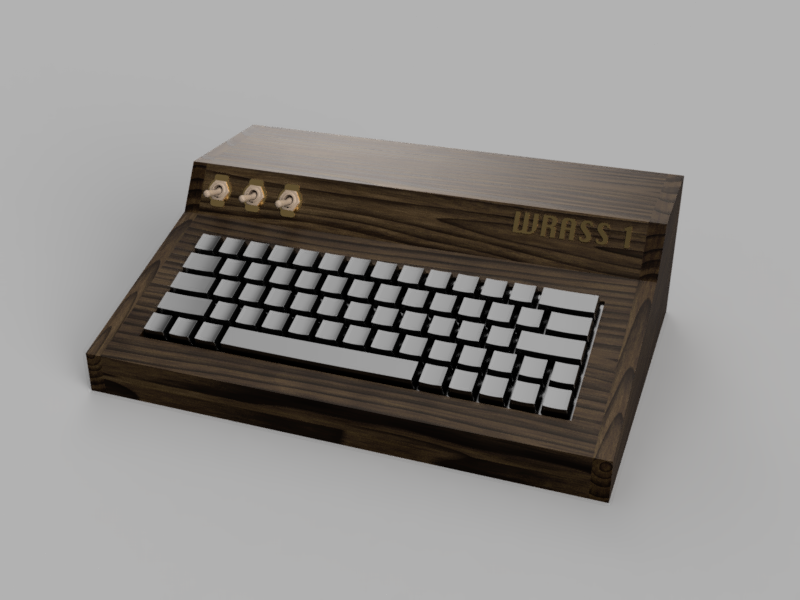

# Project Wrass

The purpose of Project Wrass is to develop the **Wrass 1**.

A 6502 based computer having the following specs.

* W65C02 running at 2Mhz
* Bankable RAM giving a total of approx 300KB of usable memory
* Expansion bus for up to 16 devices

> **Future specs**:  
>
> * VGA output of 640x480 with 256 colors
> * IO Card with 6522 Vias and support for SPI
> * Support for SD cards on IO card
> * 8Mhz CPU clock speed
> * Global scroll registers for video
> * Sprites
> * 3 channel sound synthesizer

## Software

The 16KB ROM is bankable using an external switch. This allows the computer to run "2 sets" of software.

The existing one is a simple homebrew "monitor" giving access to simple read, write and jump commands.

> **Future**:  
> Support enhanced basic